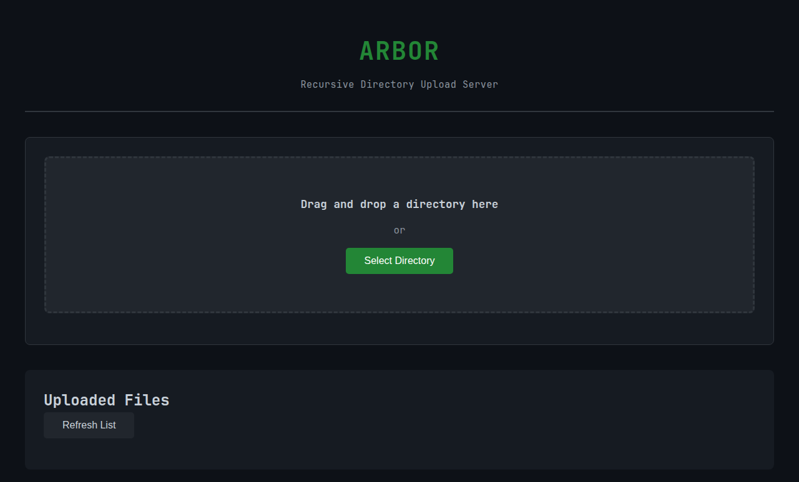

# ARBOR - Recursive Directory Upload Server

A lightweight Python web server enabling browser-based recursive directory uploads to localhost. Features include **parallel processing for accelerated transfers**, full preservation of file permissions and timestamps, WebSocket-driven real-time progress tracking, chunked streaming for large files, compression during transfer, SHA-256 integrity verification, and bidirectional sync capabilities. Designed for local development workflows, backup utilities, and file migration tasks. Modular architecture with integrated worker pool for high-performance file operations.

**[Quick Start Guide](QUICKSTART.md)** | **[Full Documentation](#installation)** | **[Contributing](CONTRIBUTING.md)**

## Screenshots


*Professional dark theme interface with JetBrains Mono font*

## Features

- **Easy to Use**: Simple drag-and-drop interface or directory picker
- **Recursive Upload**: Upload entire directory trees with preserved structure
- **Parallel Processing**: Multi-threaded worker pool for accelerated uploads and downloads
- **Metadata Preservation**: File permissions, timestamps (mtime, atime, ctime)
- **Integrity Verification**: SHA-256 checksum validation for every file
- **Real-time Progress**: WebSocket-based live updates with transfer speed and ETA
- **Modern UI**: Clean, minimal interface with dark theme and JetBrains Mono font
- **Optional Authentication**: JWT-based multi-user support
- **File Management**: Browse and download uploaded files
- **High Performance**: Async/await architecture with chunked transfers and parallel streaming
- **Security**: Path sanitization, file extension filtering, rate limiting
- **GitLab Integration**: Automatic push to GitLab via SSH with GPG signing support
- **Large File Support**: Up to 100GB upload sessions

## Installation

### Requirements

- Python 3.8 or higher
- pip package manager

### Setup

1. Clone the repository:
```bash
git clone https://github.com/alexander-labarge/arbor.git
cd arbor
```

2. Install dependencies:
```bash
pip install -r requirements.txt
```

3. (Optional) Copy and customize the example configuration:
```bash
cp config.example.yaml config.yaml
# Edit config.yaml with your preferred settings
```

4. Run the server:
```bash
python upload_server.py
```

5. Open your browser to:
```
http://localhost:8196
```

## Usage

### Basic Usage

Start the server with default settings:
```bash
python upload_server.py
```

### Custom Configuration

#### Command Line Arguments

```bash
python upload_server.py \
  --host 127.0.0.1 \
  --port 8196 \
  --upload-dir ./uploads \
  --max-file-size 500MB \
  --max-session-size 10GB \
  --workers 8 \
  --enable-auth \
  --log-level DEBUG
```

#### Configuration File

Create a `config.yaml` file:
```yaml
server:
  host: "127.0.0.1"
  port: 8196
  upload_dir: "./uploads"
  max_file_size: "100MB"
  max_session_size: "10GB"
  chunk_size: "1MB"
  workers: 16

compression:
  enabled: true
  algorithms: ["gzip", "br"]
  level: 6

security:
  auth_enabled: false
  allowed_extensions: []
  blocked_extensions: [".exe", ".bat", ".cmd", ".sh"]
  rate_limit: "100/minute"
  secret_key: "your-secret-key"

logging:
  level: "INFO"
  file: "./logs/server.log"
  format: "json"
```

Then run:
```bash
python upload_server.py --config config.yaml
```

## Configuration Options

### Server Settings

| Option | Default | Description |
|--------|---------|-------------|
| `host` | `127.0.0.1` | Host address to bind to |
| `port` | `8196` | Port to listen on |
| `upload_dir` | `./uploads` | Directory to store uploaded files |
| `max_file_size` | `100MB` | Maximum size per file |
| `max_session_size` | `100GB` | Maximum total size per upload session |
| `chunk_size` | `1MB` | Chunk size for file transfers |
| `workers` | `16` | Number of concurrent workers |

### Compression Settings

| Option | Default | Description |
|--------|---------|-------------|
| `enabled` | `true` | Enable compression support |
| `algorithms` | `["gzip", "br"]` | Supported compression algorithms |
| `level` | `6` | Compression level (1-9) |

### Security Settings

| Option | Default | Description |
|--------|---------|-------------|
| `auth_enabled` | `false` | Enable JWT authentication |
| `allowed_extensions` | `[]` | Allowed file extensions (empty = all) |
| `blocked_extensions` | `[".exe", ".bat", ".cmd", ".sh"]` | Blocked file extensions |
| `rate_limit` | `"100/minute"` | Rate limiting configuration |
| `secret_key` | `"change-me"` | JWT secret key (change in production!) |

### Logging Settings

| Option | Default | Description |
|--------|---------|-------------|
| `level` | `INFO` | Log level (DEBUG, INFO, WARNING, ERROR) |
| `file` | `null` | Log file path (null = stdout) |
| `format` | `json` | Log format |

### GitLab Integration Settings

| Option | Default | Description |
|--------|---------|-------------|
| `enabled` | `false` | Enable GitLab integration |
| `repository_url` | `""` | GitLab repository URL (SSH format) |
| `ssh_key_path` | `""` | Path to SSH private key |
| `gpg_key_id` | `""` | GPG key ID for signing commits |
| `auto_push` | `false` | Automatically push after upload |
| `branch` | `"main"` | Target branch for pushing |

## Parallel Processing

ARBOR includes a powerful worker pool module (`worker_pool.py`) that enables parallel processing of file uploads and downloads, significantly increasing transfer speeds for large files and bulk operations.

### How It Works

The worker pool uses a configurable number of threads (default: 16) to process file operations concurrently:

- **Parallel Downloads**: Large files (>10MB) are automatically split into chunks and streamed in parallel, improving download speeds by 2-4x
- **Worker Pool Management**: Automatic task queuing, retry logic, and error handling
- **Performance Metrics**: Real-time monitoring of throughput, success rates, and active tasks
- **Adaptive Processing**: Automatically switches between parallel and standard processing based on file size

### Configuration

Adjust the number of workers based on your system:

```bash
# Command line
python upload_server.py --workers 32

# Configuration file (config.yaml)
server:
  workers: 32  # Increase for high-performance systems
  chunk_size: "2MB"  # Larger chunks for faster networks
```

**Recommended Settings:**
- **Low-end systems**: 4-8 workers
- **Mid-range systems**: 16 workers (default)
- **High-performance systems**: 32-64 workers
- **Server deployments**: 64+ workers

### Monitoring Performance

Check worker pool metrics via the API:

```bash
curl http://localhost:8196/api/worker/metrics
```

Response:
```json
{
  "enabled": true,
  "total_tasks": 1523,
  "completed_tasks": 1521,
  "failed_tasks": 2,
  "active_tasks": 4,
  "success_rate": 99.87,
  "throughput_bytes_per_sec": 52428800,
  "total_bytes_processed": 2147483648,
  "elapsed_time": 40.95,
  "max_workers": 16,
  "worker_type": "thread"
}
```

### Parallel Download Usage

Enable parallel streaming for downloads by adding the `parallel=true` query parameter:

```bash
# Standard download
curl http://localhost:8196/api/files/session_id/large_file.zip -O

# Parallel download (faster for large files)
curl "http://localhost:8196/api/files/session_id/large_file.zip?parallel=true" -O
```

The parallel mode automatically activates for files larger than 10MB and can improve download speeds by 2-4x depending on your system and network.

## API Documentation

### REST Endpoints

| Method | Endpoint | Description |
|--------|----------|-------------|
| GET | `/` | Serve web interface |
| GET | `/api/auth/check` | Check if auth is required |
| POST | `/api/auth/login` | Authenticate user |
| POST | `/api/auth/logout` | Logout user |
| GET | `/api/worker/metrics` | Get worker pool performance metrics |
| POST | `/api/upload/init` | Initialize upload session |
| POST | `/api/upload/chunk` | Upload file chunk |
| POST | `/api/upload/complete` | Complete upload session |
| GET | `/api/upload/status/{id}` | Get upload status |
| DELETE | `/api/upload/{id}` | Cancel upload session |
| GET | `/api/files` | List uploaded files |
| GET | `/api/files/{path}?parallel=bool` | Download file (with optional parallel streaming) |
| POST | `/api/gitlab/push` | Push uploaded files to GitLab |

### WebSocket Endpoint

**URL:** `/ws/upload/{session_id}`

**Message Format:**
```json
{
  "type": "progress|error|complete|pause|resume|cancel",
  "sessionId": "uuid-string",
  "payload": {
    "currentFile": "path/to/file.txt",
    "overallProgress": 45.2,
    "filesCompleted": 5,
    "filesTotal": 42,
    "bytesTransferred": 1048576,
    "totalBytes": 8388608,
    "transferSpeed": 2097152,
    "eta": 3.5
  }
}
```

## Workflow

1. **Start Server**: Run `python upload_server.py`
2. **Open Browser**: Navigate to `http://localhost:8196`
3. **Authenticate** (if enabled): Enter username and password
4. **Select Directory**: Use drag-and-drop or directory picker
5. **Preview**: Review file tree and total size
6. **Upload**: Click "Start Upload"
7. **Monitor**: Watch real-time progress via WebSocket
8. **Complete**: View summary with success/failure counts
9. **Browse**: List and download uploaded files
10. **Push to GitLab** (if enabled): Automatically sync to GitLab repository

## GitLab Integration

ARBOR can automatically push uploaded files to a GitLab repository via SSH.

### Configuration

Add to your `config.yaml`:

```yaml
gitlab:
  enabled: true
  repository_url: "git@gitlab.com:username/repo.git"
  ssh_key_path: "/path/to/ssh/private/key"
  gpg_key_id: "YOUR_GPG_KEY_ID"  # Optional
  auto_push: false
  branch: "main"
```

### SSH Key Setup

1. Generate an SSH key if you don't have one:
   ```bash
   ssh-keygen -t ed25519 -C "your_email@example.com"
   ```

2. Add the public key to your GitLab account:
   - Go to GitLab Settings → SSH Keys
   - Paste the content of `~/.ssh/id_ed25519.pub`

3. Configure the SSH key path in `config.yaml`

### GPG Signing (Optional)

To sign commits with GPG:

1. Generate a GPG key:
   ```bash
   gpg --full-generate-key
   ```

2. Add GPG key to GitLab:
   - Export: `gpg --armor --export YOUR_KEY_ID`
   - Go to GitLab Settings → GPG Keys
   - Paste the exported key

3. Add your GPG key ID to `config.yaml`

### Manual Push

To manually push uploaded files to GitLab:

```bash
curl -X POST http://localhost:8196/api/gitlab/push \
  -H "Content-Type: application/json" \
  -d '{
    "session_id": "your-session-id",
    "commit_message": "Upload from ARBOR"
  }'
```

## Browser Compatibility

| Browser | Support | Notes |
|---------|---------|-------|
| Chrome 86+ | Full Support | Recommended |
| Edge 86+ | Full Support | Recommended |
| Firefox 50+ | Partial Support | webkitdirectory with prefix |
| Safari 14+ | Partial Support | Limited directory picker |

## Platform Considerations

| Platform | Permission Preservation | Timestamp Preservation | Notes |
|----------|------------------------|------------------------|-------|
| Linux | Full Support | Full Support | Complete support |
| macOS | Full Support | Partial Support | ctime requires extended attributes |
| Windows | Mapped Support | Full Support | Permissions mapped to closest equivalent |

## Security Considerations

### Default Security

- **Localhost Only**: Binds to `127.0.0.1` by default
- **Path Sanitization**: Prevents directory traversal attacks
- **Extension Filtering**: Blocks dangerous file types by default
- **Size Limits**: Configurable limits on file and session sizes
- **Checksum Verification**: SHA-256 validation for file integrity

### Authentication

When authentication is enabled:
- JWT-based token authentication
- Per-user upload directories and isolation
- Role-based access control
- Session management

### Production Deployment

**Important Security Notes:**

1. **Change the secret key** in production:
   ```yaml
   security:
     secret_key: "use-a-strong-random-key-here"
   ```

2. **Use HTTPS** when exposing to network:
   - Consider using a reverse proxy (nginx, Apache)
   - Enable TLS/SSL certificates

3. **Enable authentication** for multi-user scenarios:
   ```bash
   python upload_server.py --enable-auth
   ```

4. **Configure firewall** to restrict access

5. **Regular updates**: Keep dependencies up to date

## Troubleshooting

### Port Already in Use

If port 8196 is already in use, specify a different port:
```bash
python upload_server.py --port 8080
```

### Permission Errors

Ensure the upload directory has proper write permissions:
```bash
mkdir -p uploads
chmod 755 uploads
```

### WebSocket Connection Failed

- Check firewall settings
- Verify server is running
- Try using `127.0.0.1` instead of `localhost`

### File Upload Fails

- Check file size limits
- Verify file extension is not blocked
- Review server logs for detailed error messages

## Development

### Project Structure

```
arbor/
├── upload_server.py       # Main server application
├── worker_pool.py         # Parallel processing worker pool module
├── requirements.txt       # Python dependencies
├── config.yaml           # Configuration file (optional)
├── config.example.yaml   # Example configuration with comments
├── test_server.py        # Simple test script
├── README.md             # Documentation
├── CONTRIBUTING.md       # Contribution guidelines
├── LICENSE               # License file
├── .gitignore            # Git ignore patterns
└── uploads/              # Upload directory (created on first run)
```

### Dependencies

- **FastAPI**: Web framework
- **uvicorn**: ASGI server
- **websockets**: WebSocket support
- **python-multipart**: File upload handling
- **pyyaml**: Configuration file parsing
- **python-jose**: JWT token handling
- **passlib**: Password hashing
- **aiofiles**: Async file operations

## Contributing

Contributions are welcome! Please see [CONTRIBUTING.md](CONTRIBUTING.md) for guidelines.

To test your changes:
```bash
python test_server.py
```

## License

See [LICENSE](LICENSE) file for details.

## Support

For issues, questions, or contributions, please visit the GitHub repository:
https://github.com/alexander-labarge/arbor
